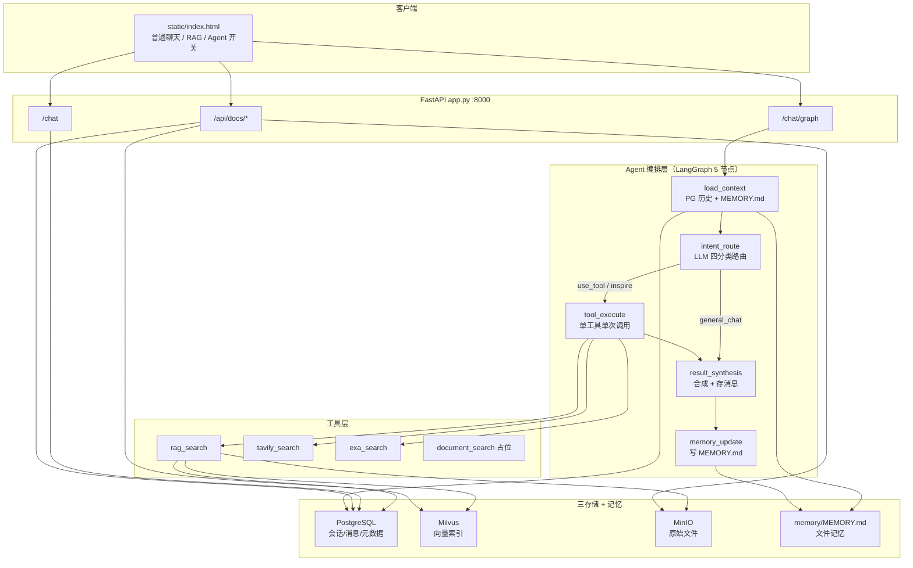

问：我补上了exa的api key，这个补测先不用做了，我们直接开始讨论下一步建议吧，或者可以先梳理一下现有项目架构，我有点犹豫，你建议一下。后续的项目开发的技术路线我倾向于harness engineering

---


好，Exa 补测先放下。下面先把现状说清楚，再按你倾向的 **Harness Engineering** 给一条可执行的路线——这也是我建议你现在走的方向。

---

## 一、你现在实际拥有什么

项目已经跨过「能跑」阶段，进入「能扩展但要防失控」阶段。可以分成三层看：




**已验收的能力：**


| 层          | 状态      | 说明                      |
| ---------- | ------- | ----------------------- |
| RAG 全链路    | ✅ 完整    | 摄入→检索→评估，Docker 四容器     |
| Agent 骨架   | ✅ 5 节点  | 闲聊 / 工具 / inspire 三条路径  |
| 记忆写入       | ✅       | CLI + 前端都能写 MEMORY.md   |
| 网页搜索       | ✅       | Tavily 端到端通过            |
| BOUND 约束层  | ⚠️ 写了没用 | `check_bound()` 零引用     |
| 多轮循环       | ❌ 未做    | 仍是单工具单次                 |
| 灵感引擎       | ❌ 未做    | `inspire` 暂时等于「选一个搜索工具」 |
| 可观测 / 回归测试 | ❌ 几乎没有  | 靠人工浏览器验收                |


你在 6.1 定型的四条规律，和当前缺口是对得上的：

> Agent 循环不值钱 → 现在 loop 还没升级  
> 能力扩展 = 写文档 → 工具注册表已就绪  
> 不信任模型，确定性兜底 → `bound.py` 还没接入  
> 文件记忆 > 向量记忆 → MEMORY.md 已跑通

---

## 二、你为什么会在「下一步」上犹豫

我觉得不是能力不够，而是**两条路线的拉力不同**：


| 路线                         | 吸引力              | 风险                                    |
| -------------------------- | ---------------- | ------------------------------------- |
| **功能线**（灵感引擎、路由微调）         | 有产品感，能立刻看到新能力    | 路由不稳、单轮 loop、没测试 harness → 越做越难 debug |
| **Harness 线**（约束、观测、测试、循环） | 和 6.1 架构哲学一致，长期稳 | 短期「不炫」，容易觉得在原地踏步                      |


P1.5 的记忆问题就是这个矛盾的缩影：**写入 OK，复述时路由误判 `rag_search`**。这不是 MEMORY 坏了，而是 **Harness 还没把「路由决策」管住、也没法稳定复现和回归**。

所以你倾向 Harness Engineering，和当前痛点是吻合的。

---

## 三、建议：阶段 6.3 = Harness 优先，功能后置

不建议现在上灵感引擎 Phase 1。它依赖：

- 多工具并行 / 多轮编排（while-true loop）
- 可观测的检索链路（否则发散检索黑盒）
- 稳定的意图区分（use_tool vs inspire）

这三样都还是 Harness 范畴。建议顺序：

### 阶段 6.3 — Harness 基础设施（推荐下一步）

```
H1 工具执行加固     → check_bound 接入 tool_execute
H2 请求追踪日志     → 每次请求记录 intent/tool/latency/error
H3 回归测试 harness → 用例驱动，覆盖 5~8 条黄金路径
H4 路由迭代         → 用 H3 的失败用例改 prompt（不是凭感觉调）
```

**H1** 最快、最符合 Harness 哲学：`web_search` 已上线，网络类工具该走 BOUND 了。  
**H2** 解决「浏览器测完不知道为啥错」——结构化 trace，比改 prompt 更有用。  
**H3** 你已有 `test/memory_test260620.py` 雏形，扩成 agent 路径测试套件。  
**H4** 记忆复述误判，用 H3 里固定用例复现，再改 `router.py`，比单独做「路由优化」更稳。

### 阶段 6.4 — Loop Engineering（Harness 之后）

```
L1 while-true 多轮工具循环（max_turns 硬限制）
L2 工具结果观察 → 决定是否继续调用
L3 预算控制（token / 工具调用次数 / 超时）
```

这时再上灵感引擎才有意义：`inspire` 不再是「选一个搜索工具」，而是「发散检索 → 收敛合成」管线。

### 阶段 6.5 — 灵感引擎（功能爆发点）

按 `docs/讨论过程/国内/005_灵感引擎-项目架构讨论总结.md` 的 Phase 1/2/3 走，但站在 6.3+6.4 的 Harness 上，不会变成黑盒。

---

## 四、四条候选路的 Harness 视角重排


| 原选项             | Harness 视角        | 建议优先级       |
| --------------- | ----------------- | ----------- |
| 路由优化            | H4：测试驱动 prompt 迭代 | 🥈 跟 H3 一起做 |
| 灵感引擎 Phase 1    | 需要 L1 多轮 loop 先行  | 🥉 延后到 6.5  |
| check_bound 接入  | H1：确定性兜底          | 🥇 **最先做**  |
| P3 docstring 清理 | 低价值               | 随时顺手        |


---

## 五、具体建议：从 H1 + H3 开始

**第一次会话目标（小、可验收）：**

1. `**tool_execute` 里调用 `check_bound()`**
  网络工具执行前检查，违规直接返回 `ToolResult(error=...)`，不碰 LLM。
2. **新建 `test/agent_paths_test.py`**
  至少覆盖：

  | 用例                     | 期望                         |
  | ---------------------- | -------------------------- |
  | 「你好」                   | `general_chat`，不调工具        |
  | 「知识库里有微服务文档吗」          | `rag_search`               |
  | 「今天科技新闻」               | `tavily_search`            |
  | 「我叫 Yukang，喜欢小步教学」     | 写入 MEMORY                  |
  | 「我的沟通偏好是什么」（新 session） | 读 MEMORY，**不走 rag_search** |

3. **跑一遍，把失败用例记下来** → 这就是 H4 的输入。

这样你得到的是：**可重复验收的 Harness**，而不是又一轮浏览器手测。

---

## 六、和「协作模式」的关系（不采纳）

Harness 阶段适合 **Mode A**（我直接写基础设施代码）+ 你验收跑测试；不必 Mode E 骨架教学——`bound.py`、`test/` 这类横切关注点，教学成本高、收益低。

灵感引擎 Phase 1 里如果有新模块（如 `inspire_diverge.py`），再切回 Mode E 逐函数学。

---

## 总结


| 问题      | 建议                                          |
| ------- | ------------------------------------------- |
| 先梳理架构？  | 上面三层图就是当前真实架构                               |
| 下一步做什么？ | **阶段 6.3 Harness**：H1 check_bound + H3 回归测试 |
| 灵感引擎？   | 有意思想法，但放到 6.5，等 loop + 测试 harness 就绪        |
| 路由优化？   | 不单独做，用测试用例驱动（H3→H4）                         |
| Exa 补测？ | 可放进 H3 用例里，和 H1 一起做                         |


如果你认可这条 Harness 路线，我们可以从 **H1（check_bound 接入）+ H3（黄金路径测试）** 开始；你也可以先说更想先做观测日志（H2）还是测试套件（H3），我按你的偏好排第一刀。